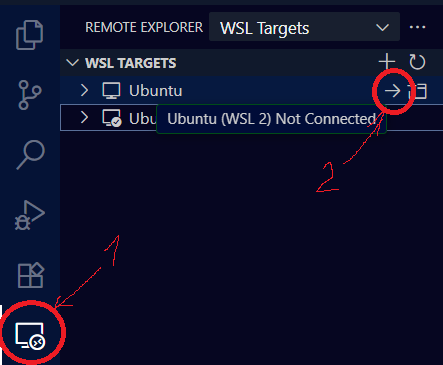

## Шаг 1. Установка виртуальной машины Linux

Как показывает практика, работа напрямую через Windows - это та ещё боль, но в самой винде предусмотрена возможность простой установки виртуалки под Linux.

Ниже приведена инструкция по установке:

**1. Открыть командную строку Windows**

**2. Запустить команду:**

```bash
wsl --install
```

**3. Перезагрузить компьютер. 
**4. В меню Пуск найти приложение Ubuntu - запустить его.
При запуске может высветиться ошибка, подобная этой (если её нет, то пропускаем пункт 4):**

```bash
WslRegisterDistribution failed with error: 0x80370102
Please enable the Virtual Machine Platform Windows feature and ensure virtualization is enabled in the BIOS
```

Это означает то, что в настройках BIOS отключена аппаратная виртуализация.

Инструкция по включению приведена здесь: [Тык](https://support.bluestacks.com/hc/ru/articles/360058102252-%D0%9A%D0%B0%D0%BA-%D0%B2%D0%BA%D0%BB%D1%8E%D1%87%D0%B8%D1%82%D1%8C-%D0%B0%D0%BF%D0%BF%D0%B0%D1%80%D0%B0%D1%82%D0%BD%D1%83%D1%8E-%D0%B2%D0%B8%D1%80%D1%82%D1%83%D0%B0%D0%BB%D0%B8%D0%B7%D0%B0%D1%86%D0%B8%D1%8E-VT-%D0%B2-Windows-10-%D0%B4%D0%BB%D1%8F-BlueStacks-5)

- Если коротко, то необходимо перейти в BIOS - как это сделать, ищи конкретно для своего компутера.
- Далее, если у тебя процессор от фирмы AMD, то необходимо найти настройку "SVM Mode, а если процессор от Intel, то настройку "Intel Virtualization Technology" - и, соответственно, включить её.

После включения виртуализации снова запускаем приложение Ubuntu - ошибка должа исчезнуть.

**4. Ждём некоторое время, пока доустанавливаются файлы.
Далее требуется создать пользователя.**

```bash
Enter new UNIX username: # Вписываешь имя пользователя, например, tomazzo, жмёшь enter
New password: # Вводишь пароль, например, 1234 - не забывай его, а то придётся помучаться, чтобы его сбросить
Retype new password: # Повторяешь пароль
```

Всё, виртуалка настроена.

## Шаг 2. Установка python

Установить поддержку змеиного языка в систему можно различными способами, но я предлагаю самый простой:

**1. Обновить пакеты Ubuntu.**

```bash
sudo apt update && sudo apt upgrade
```

**Важно**: это нужно делать перед загрузкой абсолютно любого нового пакета.

**Замечание**: если вводишь в начале команды слово 'sudo', то это оэначает, что ты запускаешь команду от имени администратора. Поэтому система потребует пароль, который ты указывал при создании пользователя.

**2. Установить дополнительный пакет**

```bash
sudo apt update && sudo apt install -y wget
```

**3. Загрузка установочного скрипта Miniconda**

```bash
wget https://repo.anaconda.com/miniconda/Miniconda3-latest-Linux-x86_64.sh
```

**4. Запуск скрипта установки**

```bash
bash Miniconda3-latest-Linux-x86_64.sh
```

**Важно:**
1. Нажми Enter для просмотра лицензии.
2. Введи yes для принятия условий.
3. Укажи путь установки (просто нажать enter).
4. На следующий вопрос нажми enter.

**5. Прописать команду:**

```bash
export PATH="/miniconda3/bin":$PATH
```

Проверить, что система знает команду "conda"

```bash
conda --version
```

Должна быть выведена версия.

**6. Создать виртуальное окружение с необходимой версией python**

```bash
conda create --name venv python=3.12
```

**7. Инициализировать conda и перезапустить терминал**

```bash
conda init
```

**8. Активировать окружение**

```bash
conda activate venv
```

**Замечание**: п.8 необходимо выполнять при каждом запуске терминала, если необходимо работать с питоном.

**9. Устанавливаем дополнительные библиотеки**

Нам для работы понадобится стандартный набор джентельмена из библиотек:

- numpy - библиотека для работы с матрицами
- pandas - библиотека для работы с таблицами внутри python
- matplotlib - библиотека для построения графиков
- plotly - библиотека для построения интерактивных графиков
- scipy - библиотека для научных вычислений по типу решения диффуров
- sympy - библиотека для символьных вычислений как в Вольфраме
- python-docx и docxtpl - библиотеки для автоматического формирования отчётов

Для установки необходимо ввести команду:

```bash
pip install numpy pandas matplotlib plotly scipy sympy python-docx docxtpl
```

Если потребуется установка какой-то другой библиотеки, прописываем простую команду:

```bash
pip install <название библиотеки>
```

Поздравляю, питончик установлен!

## Шаг 3. Установка git

**1. Обновить пакеты Ubuntu**

```bash
sudo apt update && sudo apt upgrade
```

**2. Установить git**

```bash
sudo apt install git -y
```

Для проверки установки:

```bash
git --version
```

**3. Создание пользователя git**

```bash
git config --global user.name "Ваше Имя (например, Tomazzo)"
git config --global user.email "Ваш email"
```

Проверить, что настройки сохранились:

```bash
git config --list
```

**4. Завести себе аккаунт на GitVerse: [Тык](https://gitverse.ru/home/)**

**5. Создать ключ ssh для доступа к удалённому репозиторию:**

```bash
ssh-keygen -t ed25519
```

Когда потребуется что-то вводить, всегда нажимать enter

Далее выводим ssh-ключ в терминал:

```bash
cat ~/.ssh/id_ed25519.pub
```

И копируем выведенный ключ в буфер обмена.

**6. Вписываем ssh-ключ в свой профиль на GitVerse:**

- Заходим в настройки своего профиля (кликаем по иконке профиля, в списке находим Settings).


- Переходим в раздел настроек "SSH ключи".


- Кликаем на кнопку "Добавить SSH-ключ".


- Вставлем в поле "Key" то, что скопировали в предыдущем пункте.


- Нажимаем на кнопку "Добавить SSH ключ"

Теперь мы можем получить доступ к удалённому репозиторию.

## Шаг 4. Настройка среды разработки

**1. Скачиваем и устанавливаем версию VS Code (не путать с Visual Studio!) для Windows. [Тык](https://code.visualstudio.com/download)**

**2. Открываем VS Code. На левой панели инструментов ищем вкладку "Extensions" (иконка в виде 4 квадратов).**


**3. Скачиваем расширение WSL**


**4. Подключаемся к виртуальной машине Linux в VS Code** 

- На левой панели инструментов ищем иконку с монитором, кликаем по ней.
- В списке "WSL Targets" ищем строку Ubuntu - наводим курсор на неё - должна появиться стрелка - кликаем по ней.



**5. Устанавливаем расширения для работы с python в VS Code**

    - Python (автоматически также скачаются Pylance и Python Debugger)
    - flake8
    - Jupyter

**6. (Опционально) Настраиваем тему VS Code:**

    - Жмём по шестерёнке в левом нижнем углу
    - Переходим Workbench > Appearance
    - Ищем настройку Color Theme - в выпадающем списке можно выбрать тему


